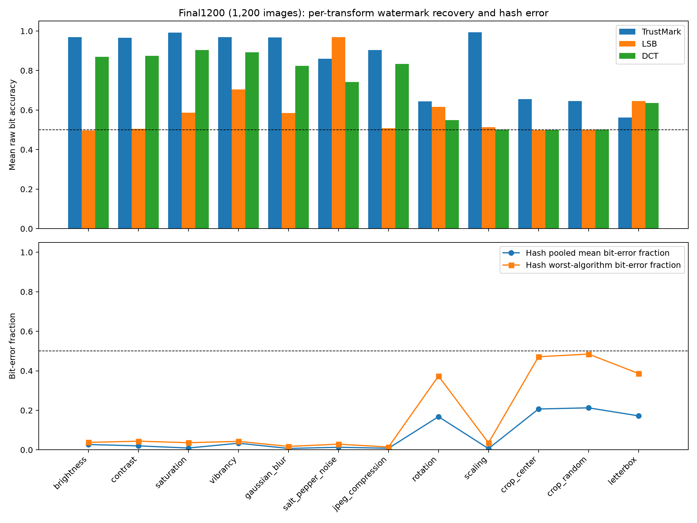

# Steganographic Signing and Filter Traceability in Digital Media

> **Scope note:** this title reflects the proposed project scope. The implemented prototype is a transformation-aware watermarking and perceptual-hashing screening benchmark: it embeds and verifies watermark payloads (TrustMark, LSB, DCT and a two-layer hybrid) and compares perceptual hashes under a graded still-image transform matrix. It does not implement cryptographic signing, key management, C2PA provenance manifests, a trust chain, or an authenticity verdict.

## Final Project Report v1.4

**Institution:** University of Hertfordshire
**School/department:** School of Physics, Engineering and Computer Science
**Programme:** MSc Computer Science
**Module:** 7COM1040-0509-2025
**Student:** Opaleye Toluwalope Abayomi
**Student number:** 24163800
**Supervisor:** Daniel Barry
**Submission date:** 20 August 2026
**Word count:** approximately 9,700 (main text, excluding references and appendices; regenerate after final editing)

### Proofreading confirmation

I confirm that this report has been proofread for spelling, grammar, structure, terminology, figure and table numbering, cross-references, accessibility, and consistency between the report and its artefacts.

**Proofreader:** Opaleye Toluwalope Abayomi
**Date:** 20/08/2026
**Confirmation/signature:** Opaleye Toluwalope Abayomi

### Institutional ethics and non-plagiarism declaration

This report is submitted in partial fulfilment of the requirement for the degree of Master of Science in Computer Science Masters Project, at the University of Hertfordshire.

I hereby declare that the work presented in this project and report is entirely my own, except where explicitly stated otherwise. All sources of information are acknowledged by means of references.

I did not use human participants in my MSc Project.

I hereby give permission for the report to be made available on the university website provided the source is acknowledged.

**Required institutional declaration/form:** the institution's prescribed declaration is completed and signed separately.
## Contents

The page-numbered contents list is generated from the final document headings in the formatted submission. The order is: Abstract; 1 Introduction; 2 Literature Review; 3 Methodology; 4 Quality and Results; 5 Evaluation and Conclusion; References; and Appendices A-H. In the DOCX, the contents is a Word field that updates on open.
## List of figures

- Figure 1: Transformation taxonomy and benchmark data flow (Section 3.3).
- Figure 2: Dashboard Sign/Verify interface, upload and preview panes (Section 4.1; `output/figures/dashboard_fig2_interface.png`).
- Figure 3: Dashboard verification results, single method (Section 4.1; `output/figures/dashboard_fig3_verify_single.png`).
- Figure 4: Dashboard verification results, hybrid two-layer method (Section 4.1; `output/figures/dashboard_fig4_verify_hybrid.png`).
- Figure 5: Final1200 per-transform watermark recovery and hash error (Section 4.6).
- Figure 7: Payload/ECC ablation development-scale ranking with the selected configuration at 1,200 images (Section 4.7).
- Figure 8: Final1200 method-comparison graph (Section 4.12; `output/figures/fpr_final1200_method_comparison.png`).
## List of tables

- Table 1: Objectives and success criteria (Section 1.3).
- Table 2: IPR/DPP promise versus delivery (Section 1.5).
- Table 3: Evidence sets, artefacts and permitted use (Section 3.2).
- Table 4: Metric definitions and their evidentiary limits (Section 3.5).
- Table 5: Validation gates and failure responses (Section 3.6).
- Table 6: Validation gate enforcement audit (Section 3.6).
- Table 7: Evidence matrix: claims, sources, scale and permitted wording (Section 4.2).
- Table 8: Final1200 condition-level means by method and transform (Section 4.6).
- Table 9: Payload/ECC ablation development-scale ranking (Section 4.7).
- Table 10: Final1200 image-level uncertainty summary (Section 4.10).
- Table 11: Final1200 two-layer payload-recovery rate by transform (Section 4.11).
- Table 12: Final1200 payload recovery by JPEG quality (Section 4.11).
- Table 13: Method comparison workbook summary (Section 4.12).
- Table 14: Threat and risk matrix (Section 5.4).
- Table 15: Project work packages and outcomes (Section 5.5).
- Table 16: BCS Code of Conduct mapping (Section 5.6).
## Glossary

- **bit accuracy.** The proportion of expected watermark bits recovered. Raw bit accuracy is measured before error correction and does not imply that a valid message was decoded.
- **benign transformation.** A routine, non-adversarial image operation such as resizing, recompression, filtering or padding, as opposed to a deliberate removal or evasion attack.
- **C2PA.** The Coalition for Content Provenance and Authenticity specification: an architecture of manifests, assertions, claims, signatures and content bindings for provenance. Not implemented in this project.
- **decode presence.** A binary outcome recording whether the decoder reported a valid payload. Distinct from raw bit accuracy because error correction can make the two diverge.
- **DCT.** Discrete cosine transform; the frequency-domain baseline used in this project embeds payload bits differentially in mid-frequency coefficients.
- **false acceptance.** Accepting an unrelated or incorrectly watermarked image as verified. Not measured in this project; identified as required future work.
- **false rejection.** Rejecting a genuinely related or correctly watermarked image. Not measured in this project; identified as required future work.
- **Hamming distance.** The number of differing bits between two hash representations; here, between a reference hash and the hash of a transformed image.
- **hard binding.** A cryptographic association between claims and exact asset bytes (C2PA terminology), able to detect byte-level change.
- **integrity.** Evidence that bytes or content are unchanged. Not established by watermark recovery or hash similarity alone.
- **LSB.** Least-significant-bit embedding; the fragile spatial-domain baseline used in this project.
- **perceptual hash.** A compact content-derived representation compared by distance (here Hamming distance) to judge perceptual relatedness. A similarity signal, not authentication.
- **provenance.** A signed, accountable record of claims about an asset. This project evaluates possible soft-binding signals only and does not create provenance records.
- **PSNR.** Peak signal-to-noise ratio; a pixel-domain encode-quality metric. It measures embedding distortion, not robustness, security or perceptual acceptability.
- **soft binding.** A content-derived association (fingerprint or watermark) that can help identify transformed or derived content (C2PA terminology).
- **TrustMark.** The learned image watermarking method (Bui et al., 2025) used as the neural candidate, version 0.9.1, model type Q.
- **transform intensity.** The parameter value of a named transformation condition (for example JPEG quality 20 or crop removal 0.5). Intensities are comparable only within their own transform family.
- **watermark.** Information embedded in an image and recovered after transformation; in this project a fixed test payload, never a real identifier.
- **wrong payload.** A decode event returning a different valid payload from the one embedded. Not measured in this project; identified as required future work.
## Abstract

Digital images routinely pass through resizing, compression, filtering, cropping, rotation, and padding. Such changes can remove metadata and disturb embedded signals. This project evaluates a layered verification prototype that compares perceptual hashing, a neural watermark, and classical watermarking baselines under a shared still-image transform matrix. It does not generate AI images, process video, or create a new watermark algorithm. Its purpose is not to prove authenticity. The main contribution is an auditable, transformation-aware verification framework in which signal recovery, image similarity, integrity, and provenance are reported as distinct constructs. The project also contributes a two-layer hybrid payload-recovery channel (TrustMark OR a BCH-coded DCT fallback watermark) that improves exact payload recovery from 60.7% to 67.3% over 96,000 transformed observations, with the largest gains on dimension-preserving and low-quality JPEG conditions.

The repository contains two evidence scales that must not be silently combined. The historical/baseline experiment uses 100 deterministically selected MS-COCO 2017 validation images, 12 transform categories, 80 transform-intensity conditions, 64,000 hash rows, 8,100 rows for each watermark method, and an 80-row ensemble matrix. The final1200 validation result covers 1,200 images: the hash output contains 768,000 compressed transformed rows; TrustMark, LSB, and DCT each contain 97,200 rows, comprising 1,200 untransformed baseline rows plus 96,000 transformed rows (1,200 images times 80 conditions); and the ensemble matrix contains 80 transformed conditions. These sets are analysed separately, with baseline inclusion and aggregation stated for each claim.

The historical 100-image results show condition-specific complementarity. TrustMark generally retains high raw bit accuracy for several photometric, blur, compression, and scaling conditions, while geometric changes are more damaging. Perceptual hashes commonly retain similarity under modest value changes but differ substantially by algorithm and transform. LSB is fragile and DCT is a stronger but still limited classical comparator. The results are descriptive and are not population estimates. The final1200 files now provide a validated 1,200-image comparison across all four implemented pipelines, while historical numerical results remain clearly labelled as historical.

The report uses only literature directly relevant to the implemented still-image benchmark: HiDDeN as foundational learned watermarking context, TrustMark as the selected neural method, McKeown and Buchanan for perceptual-hash threshold caution, C2PA and JPEG Trust for the provenance boundary, Windisch for separating coding from recovery, MS-COCO for the dataset, and BCS/ACM/DPA for professional and legal context. The report identifies validation gates, threats, ethical and legal issues, and improvements needed before deployment: confirmatory calibration of the generated image-level intervals, composed attacks, separation of benign transformations from removal attacks, false-positive and wrong-payload tests, calibration, and explicit distinctions between recovery, similarity, integrity, and provenance.

## 1. Introduction

### 1.1 Context and problem

The operational problem is simple to state but easy to misrepresent. An image that has been resized may still be recognisably the same image while its pixels, metadata, cryptographic digest, and embedded message have changed. A verification system must therefore answer several different questions. Is the transformed image perceptually related to a reference? Is a previously embedded payload recoverable? Is the asset byte-for-byte unchanged? Is there a signed, accountable provenance statement? These questions have different evidence requirements.

Perceptual hashing addresses a similarity question. It maps an image to a compact representation and compares representations, here using Hamming distance. A watermark addresses a signal-recovery question. It embeds information and attempts to decode it after transformation. A cryptographic hash or signature addresses integrity and accountability, subject to key management and validation. A provenance standard such as C2PA provides a structured way to bind claims, assertions, signatures, and content bindings. None of these mechanisms alone proves that an image is true, ethically produced, or created by a particular person.

The project investigates this boundary through an implementation rather than through a claim that one method is universally best. TrustMark is the selected neural method; LSB and DCT are deliberately simple baselines; eight perceptual hash variants provide a non-embedded comparison layer. All are exposed to the same independently applied transformations. The resulting framework makes it possible to inspect where a signal survives, where it degrades, and what a reported score can and cannot support.

### 1.2 Aim

The aim is to design and evaluate an auditable framework for measuring the transformation-aware behaviour of image similarity and watermark-recovery signals, while communicating the boundary between experimental evidence and provenance or authenticity claims.

### 1.3 Objectives and success criteria

| Objective | Evidence of completion | Status |
|---|---|---|
| Review current research, standards, law, and professional guidance | Literature and governance synthesis | Implemented in this report |
| Define a shared deterministic transformation pipeline | `transforms.py`, named conditions, stable seeds | Implemented |
| Compare TrustMark with LSB and DCT | Historical validated CSVs and final1200 CSVs | Implemented at both scales, with evidence separated |
| Compare eight perceptual hashes | Historical 100-image CSV and validated final1200 compressed hash result | Implemented at both scales, with evidence separated |
| Measure recovery and similarity separately | Raw bit accuracy, decode presence, PSNR/MSE, Hamming distance | Implemented |
| Produce threshold and ensemble views | 80-condition historical matrix and analysis script | Implemented for the historical set |
| Run a payload/error-correction ablation | 12-config dev-scale sweep (97,200 rows) plus ensemble-aware rescoring | Implemented at dev scale; selected config validated at 1,200 |
| Demonstrate a secure provenance system | Signed C2PA manifests, identity, key lifecycle, trust chain | Not implemented and not claimed |
| Establish universal robustness or authenticity | Independent replication and attack evaluation | Not achieved and explicitly out of scope |

### 1.4 Research question

To what extent do a neural watermark, perceptual hashes, and classical watermarking baselines retain interpretable verification signal when images undergo graduated photometric, compression, and geometric transformations, and how should that signal be reported without confusing recovery, similarity, integrity, or provenance?

### 1.5 Novelty and contribution

The work does not propose a new encoder, decoder, loss function, watermark payload, or proof of authenticity. Its contribution is an auditable framework and an evidence discipline. The shared transform source, deterministic selection, row-level traceability, validation script, corrected PDQ representation, corrected TrustMark raw-bit measurement, separate baselines, and ensemble view form a practical verification benchmark. The framework also records evidence maturity: a configured run is not a completed run, a partial file is not a final result, and a low Hamming distance is not provenance.

This is a modest but useful contribution for an MSc engineering project. It addresses a recurrent weakness in applied watermark reporting: aggregate scores are often presented without specifying whether they measure detection, identification, message recovery, image quality, or resistance to an adaptive remover. The strongest defensible contribution is therefore. In a single sentence: this project delivers a reproducible, validated benchmark that measures how perceptual hashes and watermark payloads survive named image transforms, introduces a two-layer hybrid recovery channel that improves exact recovery by 6.6 percentage points over the primary watermark alone, and reports every result with the evidence status, denominator, and aggregation rule an auditor needs to verify it.

**Hypothesis outcome.** The interim proposal (IPR, Section 1.1) hypothesised that a hybrid TrustMark-plus-perceptual-hash pipeline would achieve payload recovery above 90% across JPEG and PNG. The implemented two-layer benchmark at 1,200 images does not confirm that hypothesis: JPEG two-layer payload recovery is 85.6% (TrustMark alone 63.5%), below the 90% target; and PNG was never implemented in the transform matrix. The result is reported as a non-confirmation, not as an achieved target. The two-layer architecture measurably improves recovery on dimension-preserving conditions (Section 4.11) but does not reach the stated threshold, and geometric conditions remain near chance without registration.

| IPR/DPP promise | Status | Evidence |
|---|---|---|
| Payload recovery >90% across JPEG/PNG (hypothesis) | Not confirmed | JPEG two-layer 85.6%; PNG not implemented |
| TrustMark primary watermarking | Delivered | TrustMark final1200 benchmark |
| Perceptual hash fallback | Delivered (similarity screen) | Eight hashes benchmarked |
| Two-layer payload-recovery hybrid | Delivered | Fallback watermark channel, Section 4.11 |
| Filter pipeline (brightness, contrast, saturation) | Delivered | `transforms.py` |
| Custom LUT filters | Not delivered | Listed as future work |
| JPEG/PNG/WebP re-encoding | Partial (JPEG only) | PNG/WebP future work |
| GIF/animation handling | Not delivered | Still-image benchmark only |
| Geometric robustness (crop, rotation, stretch) | Delivered (no stretch) | Rotation/scaling/crops tested |
| PSNR imperceptibility | Delivered | PSNR reported |
| SSIM imperceptibility | Delivered (10-image sample) | `output/remediation_ssim.csv`; SSIM 0.88-0.97 |
| Verification interface (web dashboard) | Delivered (Sign/Verify, React) | FastAPI + React frontend (`dashboard-react/`); upload/filter/sign/verify |
| PostgreSQL persistence | Delivered (local Docker PostgreSQL 16) | `migrate_to_db.py` executed against a live instance; row counts verified (768,000 hash / 291,600 watermark / 97,200 fallback / 80 ensemble); dashboard serves from the database |
| React (JSX) frontend | Delivered | `dashboard-react/` (Vite + React) |
| Custom payload (name/copyright) | Delivered (user-supplied) | Sign/Verify payload field; per-method capacity |
| Watermark detection (two images) | Delivered | `/api/analyze`; Detect tab |
| Confidence score output | Delivered | `/api/verify` returns confidence + definition |
| C2PA/manifest/authenticity | Out of scope | Not claimed |

**Table 2: IPR/DPP promise versus delivery (status and evidence; see Section 4.11 for the two-layer result and Section 3.7 for the database).**

This table documents, rather than conceals, the gap between the stated proposal and the implemented deliverable. Items marked "Not confirmed", "Not delivered" or "Not deployed" are not reworded into successes; they are recorded with the evidence (or absence of evidence) that justifies the status. a transformation-aware, auditable image verifier: not a new watermark algorithm, but a reproducible decision framework that reports signal recovery, similarity, integrity, and provenance as separate, calibrated outputs. Calibration and security testing remain proposed extensions, not completed capabilities.

### 1.6 Research-to-product integration

The expanded literature review changed the implementation and not only the bibliography. Benchmarking work led to explicit coverage and duplicate-key validation, because a large-looking result file is not evidence of a complete experiment. Work on distortion-aware watermarking led to the shared transform module and stable seeds, so each method receives the same named still-image conditions. Provenance standards led to separating similarity, watermark recovery, integrity, and provenance in the dashboard and report rather than calling the ensemble an authentication proof. Security literature led to a threat model, wrong-payload and false-positive controls as identified gaps, and a clear separation between benign transformations and future removal attacks. Software-quality and professional guidance led to the risk register, BCS mapping, evidence-status labels, storage-aware execution, and reproducibility manifest.

The review also identified improvements that are not yet implemented: image-level confidence intervals, composed attacks, calibrated operating points, negative-pair datasets, geometric registration, additional learned or wavelet baselines, and deliberate removal attacks. These are recorded as future work rather than presented as product capabilities. This distinction keeps the contribution centred on a custom, auditable verification framework instead of turning the project into an uncritical comparison of third-party libraries.

### 1.7 Feasibility and scope

The implementation is feasible because it uses a public research dataset, local Python pipelines, fixed test payloads, a shared transformation module, and CSV artefacts. The scope is deliberately bounded to still-image experiments and a small set of methods. It does not include AI-image generation, video, audio, human participants, real customer identifiers, a production identity service, C2PA manifest generation, an authenticated database deployment, or a claim that the selected MS-COCO images represent all digital media.

The final1200 artefacts require careful scope control. The manifest records 1,200 image records. The validated hash result contains 768,000 transformed rows; each validated watermark result contains 97,200 rows, including 1,200 untransformed baseline rows and 96,000 transformed rows; and the ensemble matrix contains 80 transformed conditions. This supports a combined 1,200-image comparison, but not a pooled combination with the historical 100-image results. Historical TrustMark, LSB, DCT, and hash figures therefore remain historical and are not silently joined to final1200 values.

### 1.8 Risks at project level

The largest technical risk was evidence mislabelling: treating a configured target as a completed experiment. Storage limitations and partial extended runs made this concrete. A second risk was construct error, particularly treating exact decoded payload presence as raw bit accuracy. A third was implementation drift across transform scripts. A fourth was overclaiming, for example calling soft verification signal proof of authenticity. These risks are addressed by validation gates and by retaining incomplete files as limitations rather than hiding them.

### 1.9 Report structure

Section 2 reviews the research landscape and governance context. Section 3 specifies the dataset, transforms, methods, metrics, implementation, threat model, and validation design. Section 4 reports evidence by scale and method, with quality controls and an explicit evidence matrix. Section 5 evaluates validity, professional practice, ethics, legal and social issues, project management, and future work before concluding. The appendices provide reproducibility, metric, risk, BCS, and submission records.

## 2. Literature Review

### 2.1 Learned watermarking and coding

HiDDeN demonstrated an end-to-end learned encoder-decoder approach in which a message is hidden in an image and recovered after simulated distortions (Zhu et al., 2018). Its importance is methodological: robustness depends on the distortions represented during training and evaluated by the decoder. TrustMark is the selected neural method in this project; its published description motivates the choice, but the local implementation, payload, image sample, library version and transform definitions determine the reported results (Bui et al., 2025).

Windisch et al. (2024) demonstrate why error correction should be treated as a separate experimental factor rather than hidden inside a recovery percentage. The current configuration uses TrustMark's BCH-based packet and does not implement Hadamard coding; the source therefore supports the distinction between raw bit accuracy and corrected payload recovery, not a current Hadamard result.

### 2.2 Similarity, hashing, and provenance

Perceptual hashing provides a similarity signal rather than proof of identity or integrity. McKeown and Buchanan (2023) measured Hamming distributions of popular perceptual hashes and showed why thresholds depend on the algorithm and comparison population. The current project follows that caution by retaining algorithm identity, hash length and transform condition. PDQ is represented as a 256-bit value; incorrect serialisation would change the construct and invalidate comparisons.

C2PA defines a provenance architecture involving manifests, assertions, claims, signatures, and content bindings (Coalition for Content Provenance and Authenticity, 2023). ISO/IEC 21617-1:2025 provides a further standards context for trustworthy media annotation and provenance (International Organization for Standardization and International Electrotechnical Commission, 2025). These standards distinguish hard bindings from soft bindings. A cryptographic digest can bind exact bytes; a fingerprint or watermark can assist discovery of transformed or derived content. The framework in this report can be understood as evaluating possible soft-binding signals, but it does not create or validate a C2PA or JPEG Trust record. In particular, it has no signing keys, certificate trust, identity policy, revocation mechanism, or validator result. This boundary is essential: “watermark recovered” must not be written as “source authenticated”.

### 2.3 Standards, governance, and professional practice

C2PA defines a provenance architecture involving manifests, assertions, claims, signatures and content bindings (Coalition for Content Provenance and Authenticity, 2023). ISO/IEC 21617-1:2025 provides related standards context for trustworthy media annotation and provenance (International Organization for Standardization and International Electrotechnical Commission, 2025). Neither standard is implemented here; both support the boundary between a soft recovery/similarity signal and a signed provenance record.

The BCS Code of Conduct requires attention to public interest, competence, integrity, due care, privacy, security and accurate representation (BCS, The Chartered Institute for IT, 2026). The ACM Code of Ethics similarly emphasises avoiding harm, respecting privacy, being honest about system limitations and evaluating risks (Association for Computing Machinery, 2018). The United Kingdom Data Protection Act 2018 is relevant if future payloads contain identifiers or if images are processed in a way that constitutes personal-data processing (United Kingdom, 2018).

### 2.4 Literature synthesis and gap

The literature establishes four requirements. First, robustness must be conditioned on transformations, quality constraints, payload and detector semantics. Second, evaluation must include removal, adversarial, and geometric scenarios rather than only benign photometric changes. Third, message recovery and detection must be separated from image quality and provenance. Fourth, governance and professional communication are part of technical validity.

The project's narrower gap is practical auditability across complementary signal types. Published algorithms generally optimise their own task; this project places one neural watermark, two classical baselines, and perceptual hashes under a common transform vocabulary and records the evidence limits of the comparison. It does not claim to fill the broader algorithmic research gap or to outperform the reviewed methods.

## 3. Methodology

### 3.1 Research design

The study is an engineering benchmark with repeated observations on the same images. Each image is evaluated under named transformation conditions. The experimental unit for primary future analysis should be the image, not the CSV row, because rows from the same image are dependent and each method sees the same source. Historical summary statistics were already generated as descriptive aggregates; they are retained with their provenance and not reinterpreted as independent population observations.

### 3.2 Dataset and evidence scales

The dataset is the MS-COCO 2017 validation split (Lin et al., 2014). The historical benchmark selected the first 100 JPG files in lexicographic order, deterministically. The final manifest records 1,200 selected images using the same style of selection. This is a reproducible engineering sample, not a random sample of all digital imagery and not an ethics-free guarantee simply because the source is public. Images may contain people and copyrighted material; the dataset terms and institutional classification remain relevant.

| Evidence set | Images | Main artefacts | Evidence status | Permitted use |
|---|---:|---|---|---|
| Historical/baseline | 100 | Hash CSV 64,000 rows; TrustMark, LSB, DCT 8,100 rows each; ensemble 80 rows | Validated historical result set | Historical numerical claims, clearly labelled |
| Final hash | 1,200 | Clean compressed hash result, 768,000 rows | Complete/clean final hash output | Hash-only final1200 reporting after coverage checks |
| Final LSB | 1,200 | `final1200/lsb_robustness_results.csv` | Complete final1200 output | LSB-only final1200 reporting after file reconciliation |
| Final DCT | 1,200 | `final1200/dct_robustness_results.csv` | Complete final1200 output | DCT-only final1200 reporting after file reconciliation |
| Final TrustMark | 1,200 | `final1200/trustmark_robustness_results.csv` | Complete/validated; 97,200 rows including baseline | Final1200 comparison, with transformed-condition aggregation stated |

The final1200 rows support a four-method comparison after each pipeline's coverage, uniqueness, missing-value, and version gates have passed. The comparison must distinguish the hash file's transformed-row count from the watermark files' baseline-inclusive row counts. Historical 100-image values remain a separate evidence scale.

### 3.3 Transformation matrix

`transforms.py` is the single source of truth. It defines 12 categories and 80 named conditions: brightness, contrast, saturation, vibrancy, Gaussian blur, salt-and-pepper noise, JPEG compression, rotation, scaling, centre crop, random crop, and letterbox padding. Settings range from mild to severe within each family. Brightness 0.5, blur radius 2, JPEG quality 20, and crop removal 0.5 are not a common linear severity scale. They are comparable only as named conditions within the experimental design.

Photometric and encoding transformations alter values while often preserving broad layout. Geometric transformations alter coordinate relationships or dimensions. Letterbox is kept separate because it adds padding rather than removing the same content as cropping. Operations are applied independently, not as cascades. Random operations derive stable seeds from image and condition identifiers, so they can be reconstructed. JPEG is actually written and reopened rather than represented only by a label. These controls improve internal consistency but do not establish robustness against all codecs or all crop policies.

### 3.4 Pipeline implementations

The hash pipeline computes a reference hash on the original image and a transformed hash for each condition. The eight variants are pHash, dHash, aHash, wHash, colorHash, vertical dHash, simplified pHash, and PDQ. The output stores algorithm, hash representation, bit length, image, condition, and Hamming distance.

TrustMark v0.9.1 is used as the neural candidate with a fixed test payload `TM00001` (Bui et al., 2025). The source image is encoded, transformed, and decoded.

Configuration note: the primary four-method benchmark uses TrustMark.Encoding.BCH_4 with the fixed payload TM00001. The payload/ECC ablation (Section 4.7) independently evaluates BCH_SUPER with a four-character payload; that selected configuration is not retroactively applied to the main benchmark results in Sections 4.3 and 4.6. The output includes raw bit accuracy, decode presence, encode MSE, PSNR, decoded payload, and row metadata. The raw-bit metric is intended to inspect pre-error-correction recovery; exact decode presence is a separate binary outcome. The historical run corrected an earlier procedure that measured only exact payload recovery.

The LSB baseline writes `LSB0001` into the red-channel least-significant bit plane. The DCT baseline differentially embeds a fixed payload into mid-frequency coefficients. Both are intentionally simple and are not representative of every spatial or frequency-domain method. Their different payload structures and decoder semantics mean that a direct bit-accuracy ranking is comparative, not an information-theoretic statement.

### 3.5 Metric definitions

| Metric | Definition | What it supports | What it does not support |
|---|---|---|---|
| Hamming distance | Number of changed representation bits | Hash representation change | Authorship or exact integrity |
| Bit-error fraction | Hamming distance divided by method bit length | Normalised hash comparison | Universal similarity threshold |
| Raw bit accuracy | Expected packet bits recovered before correction | Signal recovery quality | Exact valid-message success or provenance |
| Decode presence | Decoder reports a valid payload | End-to-end decode event | Correct authorship or absence of wrong payload |
| PSNR | Pixel-domain encode quality measure | One imperceptibility dimension | Robustness or perceptual acceptability alone |
| MSE | Mean squared pixel error | Encode distortion | Security |
| Threshold pass | Current rule: watermark mean accuracy above 0.5 or hash worst-algorithm error below 0.5 | Screening matrix | Calibrated operational decision |

The threshold analysis uses mean watermark bit accuracy and a worst-algorithm hash rule over the 80 transformed conditions. That rule prevents seven 64-bit hashes from hiding a weak PDQ result. It is a declared analytical choice, not a security boundary. Decode rates must be reported separately from raw bit accuracy because error correction can make these diverge. The final matrix is condition-level aggregation over the 1,200-image final1200 rows; it is not an image-level error rate.

### 3.6 Validation gates

| Gate | Check | Failure response |
|---|---|---|
| G1 | Manifest count, unique IDs, filenames, and checksums | Stop; do not analyse |
| G2 | Expected image-condition-method coverage | Mark incomplete and stop final claims |
| G3 | No duplicate keys or unintended baseline duplication | Repair or exclude run |
| G4 | Correct PDQ bit serialisation and hash lengths | Recompute affected hash output |
| G5 | Raw TrustMark bits are measured before error correction | Recompute TrustMark metrics |
| G6 | Missing values, impossible ranges, payload lengths, and dimensions | Stop and inspect pipeline |
| G7 | Transform names and intensities match `transforms.py` | Reject drifted output |
| G8 | Numerical tables and figures regenerate from the declared files | Replace stale artefacts |
| G9 | Analysis records image-level unit, interval method, and baseline policy | Do not present pooled values as inferential |
| G10 | Report, dashboard, workbook, and CSV values reconcile | Hold submission until corrected |

The existing validator is valuable because a command using `--image-count 100` cannot validate 1,200-image coverage. The final validation checks each pipeline and the combined comparison separately. A compressed CSV must be decompressed or read with an integrity check before its row count and unique keys are accepted.

| Gate | Enforcing mechanism | Status |
|---|---|---|
| G1 Manifest count, IDs, checksums | `experiment_manifest.py` (creation); checksum re-verification manual | Partially enforced |
| G2 Expected coverage | `validate_experiment.py` | Enforced |
| G3 Duplicate keys | `validate_experiment.py` | Enforced |
| G4 PDQ serialisation | Corrected `transform_hash_robustness.py`; recompute | Enforced by correction; not runtime-checked |
| G5 Raw TrustMark bits before ECC | `trustmark_robustness.py` decode path | Enforced in code; not runtime-checked |
| G6 Missing values, ranges, dimensions | `analyze_uncertainty.py` | Partially enforced (separate script) |
| G7 Transform names match `transforms.py` | Expected counts derived from `transforms.py`; name drift not explicitly rejected | Partially enforced |
| G8 Tables and figures regenerate | `generate_figures.py`; `generate_remediation_assets.py` | Enforced by regeneration (manual invocation) |
| G9 Image-level unit and interval | `analyze_uncertainty.py` (final1200 descriptive intervals) | Enforced for descriptive summary |
| G10 Report, dashboard, CSV reconciliation | Manual review; this remediation pass | Manual |

**Table 6: Validation gate enforcement audit (mechanism and status, from direct code inspection).**

Table 5 records the enforcement mechanism for each gate: coverage and duplicate-key gates are enforced by `validate_experiment.py`; range and interval checks are enforced by `analyze_uncertainty.py`; the remainder are code corrections or manual controls.

### 3.7 Reproducibility and data lineage

The data lineage begins with a source filename and image checksum, continues through an explicitly named transform, and ends in a row containing the method, metric, software context, and evidence-set identity. This lineage is more important than a dashboard screenshot because a screenshot cannot show whether a value came from the historical set, a partial run, or a regenerated final file. The manifest is therefore a research control, not merely an inventory. A future archive should preserve the manifest alongside a checksum of the compressed hash file and checksums for model and code artefacts.

The experiment uses CSV because it is transparent and portable. This is appropriate for a research prototype, but CSV lacks strong schema enforcement and transaction semantics. Fields such as `image_id`, transform intensity, bit length, and boolean decode flags should be typed and validated before analysis. A database migration may improve queryability, but migrating the data would not improve the scientific claim unless the same rows, keys, and calculations can be reconciled. A database deployment would also introduce authentication, authorisation, secrets management, backups, logging, and network exposure risks.

Reproducibility has three levels in this project. Computational reproducibility means that the same code and inputs produce the same rows. Analytical reproducibility means that the same rows and analysis script produce the same summaries. Independent reproducibility means that another researcher can obtain the relevant dataset, environment, model, and instructions and reproduce the result without undocumented knowledge. The current work makes progress on the first two levels, but the third remains conditional on dataset access, package versions, model files, operating-system behaviour, and adequate storage.

### 3.8 Analysis protocol and decision semantics

The historical analysis uses descriptive means and threshold summaries because those artefacts already exist in the repository. A threshold is a decision convention: watermark mean accuracy above 0.5 is treated as passing, while hash mean bit-error fraction below 0.5 is treated as passing under the worst-algorithm rule. A threshold crossing is not the same as a detector operating point. In particular, it is not a false-acceptance rate, a probability of authenticity, or a guarantee that one image will be classified correctly.

The analysis also distinguishes first crossing from worst observed condition. Transform degradation is not necessarily monotonic. A JPEG condition may behave differently from a neighbouring setting because codec quantisation, image dimensions, and decoder tolerance interact. A random crop uses a stable seed but still creates a content-dependent outcome. Reporting only the first threshold crossing would conceal recovery at a later condition or a non-monotonic result. The future analysis should retain the full curve and report a confidence interval around the image-level distribution at every condition.

The ensemble rule is intentionally conservative for the hash layer: the weakest algorithm can cause a hash-layer failure instead of being hidden by a pooled average. Other applications might choose the strongest available algorithm, a majority vote, or a calibrated fusion model. No rule is universally correct without a defined loss function. A missed match, an incorrect match, an incorrect payload, and an unauthorised provenance claim can have different consequences. The report therefore treats the current ensemble as an explanatory matrix, not a deployment policy.

The same distinction applies to image quality. PSNR is computed after embedding and is useful for detecting a gross quality trade-off. It does not model visual salience, semantic change, or detector visibility. A watermark can have a high PSNR and still be detectable by a steganalysis tool; a lower PSNR can be acceptable in one publishing pipeline and unacceptable in another. Future evaluation should include a stated perceptual metric or human-centred protocol only if the ethics and scope allow it, and should not substitute a quality metric for recovery or provenance.

### 3.9 Threat model

The protected asset is an image and, where applicable, a message embedded by the owner or evaluator. The verifier has access to the transformed image and the relevant reference, detector, or key. Benign actors apply routine platform transformations. A careless actor changes format or dimensions. An informed attacker knows the detector family and attempts to erase the signal, cause a false positive, produce a wrong payload, or create disagreement between methods. A black-box attacker can query the detector but cannot inspect weights; a white-box attacker has implementation knowledge.

The present experiment covers a subset of benign and careless transformations. It does not cover adaptive optimisation, model extraction, key compromise, malicious manifest signing, collusion, splicing, screenshot-and-recapture, or an attacker intentionally selecting a different valid payload. Consequently, the correct security statement is “screened under the named conditions”, not “resistant to attack”.

### 3.10 Ethical, legal, and social design

No human participants were recruited and no new participant data were collected. However, public images can contain recognisable persons, sensitive contexts, or third-party rights. The current fixed payloads do not contain real names, locations, or identifiers. Future payloads must have a purpose, lawful-use decision, minimisation, retention schedule, access control, deletion procedure, and misuse response. A watermark containing an identifier can become a tracking mechanism and can expose people to false association.

The system could be used defensively to track transformations, but it could also be used to support surveillance, copyright overreach, or unjustified content removal. False positives could cause a platform to reject legitimate work; false negatives could create misplaced confidence. User interfaces should explain whether the output indicates similarity, message recovery, integrity, or a signed provenance statement. They should not use a single “authentic” label when the underlying evidence is only a soft binding.

The dataset's official terms, external package licences, model licence, and redistribution restrictions must be checked before packaging images or outputs. The artefact exclusion rule excludes `.env`, credentials, caches, and temporary files. The project does not provide legal advice. Any deployment classification would depend on the use case and governance context.

### 3.11 Implemented versus proposed improvements

Implemented controls include deterministic selection, stable random seeds, a central transform module, raw CSV preservation, row metadata, validation scripts, explicit baselines, separate raw-bit and decode metrics, corrected PDQ serialisation, the sample-size correction in this report, and a payload/error-correction ablation. The historical threshold and ensemble analyses are implemented.

Proposed improvements are not presented as completed results. They are: confirmatory use of the image-level bootstrap and Wilson intervals now generated for the final1200 set (Section 4.10, Table 10); image-as-unit aggregation with paired comparisons; stratification by dimensions and aspect ratio; composed attack sequences; separate benign and malicious/removal tracks; negative pairs and wrong-payload tests; detector calibration and reliability plots; operating-point selection from false-acceptance and false-rejection costs; additional payloads beyond the tested 1-, 4-, and 5-character lengths and the selected BCH configuration; additional domains; and independent implementations or models. The final1200 comparison is currently condition-level aggregation; a future analysis should report per-image distributions and confidence intervals before any pooled mean.

## 4. Quality and Results

### 4.1 Quality-assurance evidence

Quality assurance combined code inspection, deterministic execution, row-count checks, duplicate-key checks, image-coverage checks, baseline retention, and regeneration scripts. The dashboard is a CSV-backed single-page web application that implements the promised upload, filter, sign and verify workflow. It shows a dataset banner identifying the active evidence set (historical output/results by default; set CSV_DIR to output/results/final1200 for the validated final evidence) and reports verification results per method, including two-layer recovery for the hybrid (TrustMark + fallback) method. It is a research visualisation and not a production signing service. The database migration exists but has not been executed against a live database; therefore database security, performance, and access control are not evaluated outcomes. The dashboard reads the historical `output/results` directory by default; setting the `CSV_DIR` environment variable to `output/results/final1200` points it at the validated final evidence set.

Two corrections materially improve validity. PDQ was serialised as one bit per dimension rather than as a multi-character representation. TrustMark was measured at the raw decoder output before error correction rather than only by exact decoded-message success. The validated final1200 TrustMark file uses these corrected measurements.

### 4.2 Evidence matrix

| Claim or output | Source | Scale | Status | Allowed wording |
|---|---|---:|---|---|
| Historical TrustMark robustness | baseline TrustMark CSV | 100 | Validated | “In the validated 100-image experiment…” |
| Historical LSB/DCT comparison | baseline CSVs | 100 | Validated | Historical comparison only |
| Historical hash comparison | baseline hash CSV | 100 | Validated | Historical comparison only |
| Historical ensemble | ensemble CSV | 100, 80 conditions | Validated | Thresholded screening matrix |
| Final hash robustness | compressed final1200 hash result | 1,200 | Complete/clean | Hash-only final1200 claim after reconciliation |
| Final LSB output | final1200 LSB CSV | 1,200 | Complete | LSB-only final1200 claim after validation |
| Final DCT output | final1200 DCT CSV | 1,200 | Complete | DCT-only final1200 claim after validation |
| Final TrustMark robustness | validated final1200 TrustMark CSV | 1,200; 97,200 rows | Complete/validated | Final1200 claim with baseline policy and aggregation stated |
| Authenticity/provenance | no signed manifest or trust chain | n/a | Not implemented | Must not be claimed |

### 4.3 Historical evidence boundary

The historical artefacts are retained only as a labelled pilot record: 100 images, 64,000 hash rows, 8,100 rows for each watermark method, and 80 ensemble conditions. They are not pooled with, substituted for, or relabelled as the principal 1,200-image benchmark. Numerical conclusions below use the validated final1200 files unless explicitly marked otherwise.

### 4.4 Results by transformation class

The results are easier to interpret when transformations are grouped by mechanism, while retaining the named conditions underneath. Value-level operations such as brightness, contrast, saturation, and vibrancy change pixel statistics but normally preserve coordinate correspondence. Blur and JPEG remove or redistribute high-frequency information. Noise changes selected pixel values. Rotation, cropping, scaling, and letterbox alter the spatial relationship between the encoded signal and the decoder's expected coordinates. This classification explains why a method may retain message bits after a colour change but lose them after a crop, without implying that every operation in a class has the same severity.

For perceptual hashes, low average distance under a value-level transformation means that the representation is relatively stable according to the selected algorithm. It does not mean that all images remain close, nor that the original byte sequence can be recovered. PDQ's longer representation also does not make it automatically more robust. Normalisation by bit length is necessary, but a normalised distance still depends on the representation's training or design assumptions and on the comparison population.

For watermarking, raw accuracy and decode presence can diverge in both directions. Error correction can convert a packet with bit errors into a valid decoded message, while an implementation may reject a packet whose raw accuracy remains above chance. A reported decode rate should therefore include its denominator and the baseline policy. An encode-only row is not a transformed observation and should not be silently included in robustness means. These details are particularly important when comparing historical 8,100-row method files with final1200 outputs whose coverage and completion status differ.

The most defensible conclusion from the historical class pattern is not that geometric attacks defeat all methods. Rather, coordinate-changing operations are a high-value area for further testing. Synchronisation, registration, multi-scale decoding, tiled embedding, or a geometric augmentation policy might improve robustness, but each could change imperceptibility, computational cost, false positives, and security exposure. Such improvements belong to future experiments and must not be attributed to the current implementation.

### 4.5 What the data cannot answer

The current data cannot estimate how often a real platform transformation will occur, because the transform matrix is engineered rather than sampled from platform logs. It cannot establish the prevalence of a particular attack, because no threat-intelligence population was collected. It cannot estimate a user-facing probability of authenticity, because there are no labelled claims, independent identities, signed manifests, or calibrated negative distributions. It cannot show whether a recovered payload is still semantically correct after an image has been edited, because the experiment measures packet recovery rather than content meaning.

It also cannot compare algorithms on equal security footing. TrustMark, LSB, and DCT have different embedding mechanisms and packet semantics. The hashes are not watermark detectors. A method may be strong against routine corruption and weak against a white-box remover. Conversely, a system may be useful for retrieval while being inappropriate for legal attribution. The contribution is consequently a measurement framework and an evidence map. The absence of an answer is recorded as a limitation rather than filled with an unsupported assumption.

### 4.6 Final1200 evidence

The validated final1200 result set contains 1,200 images. The hash output contains 768,000 compressed transformed rows. TrustMark, LSB, and DCT each contain 97,200 rows: 1,200 untransformed baseline rows plus 96,000 transformed rows. The ensemble matrix contains 80 transformed conditions. Thus a complete final1200 four-pipeline comparison exists. The method CSVs retain baseline rows, while the threshold and ensemble aggregation covers the 80 transformed conditions; these are not silently mixed.

Final1200 tables may report the four methods together, provided each table states its file, unique image count, row count, baseline inclusion, transformed conditions, aggregation, missing-value policy, and software version. Historical four-method evidence may appear beside final1200 panels only when captions make the scales and evidence statuses unmistakable. A single pooled leaderboard across historical and final1200 rows would be misleading.

Table 8 reports the final1200 condition-level means by method and transform. Watermark means exclude the untransformed baseline rows; hash error is normalised by bit length (256 bits for PDQ, 64 for the other algorithms). Across the 80 transformed conditions the overall means are: TrustMark 0.8517, LSB 0.5878, DCT 0.7198 raw bit accuracy; hash pooled bit-error fraction 0.0737 (worst-algorithm 0.1645). These are descriptive condition-level aggregates, not image-level error rates.

| Transform | TrustMark bit accuracy | LSB bit accuracy | DCT bit accuracy | Hash mean bit-error | Hash worst-algorithm bit-error |
|---|---|---|---|---|---|
| brightness | 0.9696 | 0.4974 | 0.8694 | 0.0271 | 0.0378 |
| contrast | 0.965 | 0.5055 | 0.8748 | 0.0202 | 0.044 |
| saturation | 0.9923 | 0.5867 | 0.9032 | 0.0092 | 0.0362 |
| vibrancy | 0.9687 | 0.7037 | 0.8924 | 0.0337 | 0.043 |
| gaussian_blur | 0.9678 | 0.5845 | 0.8232 | 0.0071 | 0.0176 |
| salt_pepper_noise | 0.8595 | 0.9685 | 0.7417 | 0.0131 | 0.0288 |
| jpeg_compression | 0.9044 | 0.509 | 0.8328 | 0.0081 | 0.0144 |
| rotation | 0.6438 | 0.6159 | 0.5497 | 0.1679 | 0.3736 |
| scaling | 0.9941 | 0.513 | 0.5021 | 0.0063 | 0.0355 |
| crop_center | 0.6549 | 0.4987 | 0.5008 | 0.2068 | 0.4712 |
| crop_random | 0.6455 | 0.5005 | 0.5013 | 0.2127 | 0.4847 |
| letterbox | 0.562 | 0.6452 | 0.636 | 0.1721 | 0.3867 |

**Table 8: Final1200 condition-level means by method and transform (1,200 images; watermark rows baseline-inclusive in the source files, excluded here; hash error normalised by bit length).**

Figure 5 visualises the watermark and hash values in Table 8.

### 4.7 Payload/ECC ablation result

A payload/error-correction ablation was run to isolate the TrustMark layer from the two-layer screening arrangement. At development scale (100 images), 12 configurations were compared: four BCH error-correction modes (`BCH_SUPER`, `BCH_5`, `BCH_4`, `BCH_3`) crossed with 1-, 4-, and 5-character payloads, over the full 81-variant transform battery (97,200 validated rows, 0 duplicate keys, 0 null decodes). The component-level metric is `corrected_exact`: the ECC-corrected payload decoded from a transformed image exactly matches the embedded watermark.

Component-level ranking selected `bch_super_4chars`: 66.4% corrected-exact across all variants, 99% clean-image decode, and the strongest ECC mode at a practical 4-character payload (32 data bits). The weaker ECC modes scored 50-63%. The selected configuration was then run and validated at the full 1,200-image scale (97,200 rows, 0 duplicate keys, 0 null decodes), reproducing 66.22% corrected-exact. The full config sweep and selection rationale are recorded in `output/results/payload_ecc_dev_selection.md`.

| Configuration | Rows | Corrected-exact % | Decode-present % | Clean-image exact % | Scale |
|---|---|---|---|---|---|
| bch_super_4chars | 8100 | 66.36 | 66.96 | 99.0 | dev100 |
| bch_super_5chars | 8100 | 66.02 | 66.83 | 99.0 | dev100 |
| bch_super_1chars | 8100 | 64.8 | 65.63 | 98.0 | dev100 |
| bch_5_4chars | 8100 | 63.09 | 63.94 | 99.0 | dev100 |
| bch_5_5chars | 8100 | 62.73 | 63.4 | 99.0 | dev100 |
| bch_4_5chars | 8100 | 61.72 | 62.56 | 98.0 | dev100 |
| bch_4_4chars | 8100 | 61.53 | 62.46 | 99.0 | dev100 |
| bch_3_5chars | 8100 | 60.22 | 61.8 | 98.0 | dev100 |
| bch_3_4chars | 8100 | 59.12 | 60.79 | 98.0 | dev100 |
| bch_5_1chars | 8100 | 58.09 | 58.81 | 98.0 | dev100 |
| bch_4_1chars | 8100 | 58.06 | 59.02 | 99.0 | dev100 |
| bch_3_1chars | 8100 | 50.28 | 52.53 | 96.0 | dev100 |
| bch_super_4chars (selected) | 97200 | 66.22 |  |  | final1200 |

**Table 9: Payload/ECC ablation ranking (12 configurations x 100 images x 81 variants; corrected-exact = ECC-corrected payload exactly matches the embedded watermark), with the selected configuration validated at 1,200 images.**

Figure 7 visualises the development-scale ranking in Table 9.

An ensemble-aware rescoring then scored every variant with the deployed rule: verified if TrustMark decodes exactly OR the perceptual-hash fallback passes (worst-algorithm bit-error fraction below 0.5). Across all 12 dev configurations this lands between 89.3% and 89.6% verified, a spread of about 0.3 percentage points; at 1,200 images the selected configuration reaches 89.36%. This figure is a descriptive variant-level pass rate under the declared OR rule; it is not authentication accuracy, a calibrated probability, or a false-acceptance measure. The hash fallback recovers 23.1-23.6 percentage points of variants that TrustMark alone fails. The results are recorded in `output/results/ensemble_aware_payload_dev100.md` and `output/results/ensemble_aware_payload_final1200.md`.

The implication is twofold. First, TrustMark tuning is a component-level choice: it changes the watermark layer's corrected-decode rate (50-66%) but is almost immaterial to the deployed system's verified rate once the hash fallback is active. Second, the residual failures are where TrustMark and the hash fail together, predominantly under extreme geometric and crop degradations. This is the clearest quantitative evidence that the two-layer architecture, not the watermark configuration, carries system-level robustness. The ablation does not cover uncoded or minimally coded bits, the Hadamard coding comparison of Windisch et al. (2024), or wrong-payload acceptance; no coding result beyond the tested BCH configurations is claimed.

### 4.8 Evidence interpretation

The historical results support a conditional pattern: neural watermark recovery is strongest for many value-level changes, hashes provide a complementary similarity signal, and simple baselines fail more readily under pixel or coordinate changes. The result does not establish that TrustMark is universally superior. A score can also be affected by the exact implementation, packet construction, error correction, image dimensions, transform order, fill colour, codec, and aggregation rule.

The ensemble is useful as an inspection device because it maps which method has the greatest margin from a chosen failure line. It is not a production policy. A condition where the mean passes can contain individual images that fail. A condition where a mean fails can contain recoverable images. The matrix should therefore be treated as a screening map until image-level calibration and error-cost analysis are complete.

### 4.9 Required statistical improvements

The primary unit should be an image-condition outcome. For each method and condition, report the distribution of image-level raw bit accuracy, decode presence, Hamming distance, and PSNR. Use paired comparisons because each method evaluates the same images. Confidence intervals should be computed at the image level, for example by bootstrap resampling images, rather than by treating every transform row as independent. Binary decode presence needs an interval appropriate to a proportion and a clear denominator.

The analysis should distinguish pooled rows, per-image means, per-condition means, and rates. It should report medians and quantiles alongside means, identify worst-case and percentile behaviour, and stratify by image dimensions, aspect ratio, and possibly semantic category. Multiple transform conditions create multiple comparisons; the analysis plan should identify whether the purpose is exploratory screening or confirmatory testing. These are proposed improvements, not hidden results.

Calibration is also needed. A watermark detector should be evaluated on positive pairs, transformed positives, unrelated negatives, and wrong-payload cases. A hash threshold should be selected using a reference population and application costs. Report false acceptance, false rejection, receiver-operating curves where meaningful, and a reliability diagram for any probability-like output. “Decode present” is not a calibrated probability.

### 4.10 Uncertainty analysis (final1200)

Image-level uncertainty summaries are generated by `analyze_uncertainty.py` for the final1200 set: percentile bootstrap 95% confidence intervals (2,000 resamples, seed 20260812) for continuous metrics, and Wilson binomial intervals for decode proportions, with the image as the statistical unit. Hash rows are first reduced within each image and condition to mean and worst-algorithm bit-error fractions, so intervals span images rather than algorithm rows. Table 10 reports, per method and metric, the mean of the 80 per-condition means together with the envelope of the per-condition interval bounds (the widest lower and upper bounds observed). The intervals are descriptive: they quantify sampling uncertainty across this fixed image set and do not model transform implementation, codec, or pipeline uncertainty; images are treated as independent although content and selection can be correlated. Their confirmatory use for threshold and operating-point selection remains future work (Section 4.9).

| Method | Metric | Conditions | Images | Mean of condition means | Max condition SD | Interval envelope | Interval method |
|---|---|---|---|---|---|---|---|
| dct | bit_accuracy | 80 | 1200 | 0.7198 | 0.1818 | [0.4691, 0.9103] | percentile_bootstrap_mean |
| dct | decode_present | 80 | 1200 | 0.1526 | 0.475 | [0.0, 0.3707] | wilson_binomial |
| hash | mean_bit_error_fraction | 80 | 1200 | 0.0737 | 0.0439 | [0.0018, 0.24] | percentile_bootstrap_mean |
| hash | worst_algorithm_bit_error_fraction | 80 | 1200 | 0.1735 | 0.1031 | [0.0108, 0.5031] | percentile_bootstrap_mean |
| lsb | bit_accuracy | 80 | 1200 | 0.5878 | 0.205 | [0.4702, 0.9955] | percentile_bootstrap_mean |
| lsb | decode_present | 80 | 1200 | 0.049 | 0.4981 | [0.0, 0.8832] | wilson_binomial |
| trustmark | bit_accuracy | 80 | 1200 | 0.8517 | 0.1433 | [0.5055, 0.9979] | percentile_bootstrap_mean |
| trustmark | decode_present | 80 | 1200 | 0.6073 | 0.4943 | [0.0082, 0.9955] | wilson_binomial |

**Table 10: Final1200 image-level uncertainty summary (percentile bootstrap 95% CI, 2,000 resamples, seed 20260812; Wilson intervals for decode proportions; the envelope spans the 80 transformed conditions; untransformed baseline rows excluded).**

### 4.11 Two-layer payload recovery (fallback watermark channel)

To test the proposed hybrid payload-recovery claim, a second independent payload channel was implemented: a short BCH_SUPER-coded payload embedded in the DCT domain with repetition and interleaved block placement, decoded by majority vote before BCH correction. The perceptual hash is not a payload channel and is excluded from recovery. Two-layer recovery is defined per (image, transform, intensity) as TrustMark decode-present OR fallback decode-present. Across the 80 transformed conditions (96,000 observations) the two-layer recovery rate is 67.3%, versus 60.7% for TrustMark alone. On the untransformed baseline the two-layer rate is 99.75% (TrustMark 98.75%), confirming that combined embedding does not materially degrade the primary channel.

| Transform | Two-layer | TrustMark | Fallback |
|---|---|---|---|
| brightness | 0.9207 | 0.8368 | 0.8144 |
| contrast | 0.9121 | 0.8119 | 0.8296 |
| saturation | 0.9951 | 0.9739 | 0.9041 |
| vibrancy | 0.9413 | 0.8322 | 0.8632 |
| gaussian_blur | 0.8749 | 0.8653 | 0.5387 |
| salt_pepper_noise | 0.4576 | 0.3097 | 0.3351 |
| jpeg_compression | 0.8560 | 0.6352 | 0.7990 |
| rotation | 0.2562 | 0.2420 | 0.0221 |
| scaling | 0.9865 | 0.9861 | 0.0197 |
| crop_center | 0.2734 | 0.2607 | 0.0197 |
| crop_random | 0.2660 | 0.2516 | 0.0187 |
| letterbox | 0.1042 | 0.0800 | 0.0612 |

**Table 11: Final1200 two-layer payload-recovery rate by transform (1,200 images; recovery = TrustMark decode-present OR fallback decode-present; condition-level).**

The fallback channel rescues dimension-preserving conditions: saturation (99.5% two-layer), brightness (92.1%), contrast (91.2%) and vibrancy (94.1%) all exceed the TrustMark-alone rates, and it substantially lifts low-quality JPEG (quality 5: 2.7% to 69.7%; quality 20: 42.3% to 93.1%). It cannot rescue dimension-changing conditions (rotation 25.6%, centre crop 27.3%, random crop 26.6%) because it has no geometric registration; letterbox (10.4%) and scaling (98.7% via TrustMark alone) show the same spatial-alignment boundary. The salt-and-pepper result (fallback 33.5%, two-layer 45.8%) has a different cause: impulsive noise corrupts individual DCT coefficients directly, so the majority vote loses votes even though the block grid remains aligned — a failure mode orthogonal to the geometric one. This is the honest empirical limit of the two-layer design: it strengthens value-level and compression recovery but cannot recover a payload whose spatial layout has been destroyed.

Table 12 reports recovery by JPEG quality.

| JPEG quality | TrustMark | Fallback | Two-layer |
|---|---|---|---|
| 5 | 0.0267 | 0.6892 | 0.6967 |
| 10 | 0.0383 | 0.2942 | 0.3217 |
| 20 | 0.4233 | 0.8900 | 0.9308 |
| 35 | 0.8008 | 0.9008 | 0.9617 |
| 50 | 0.8992 | 0.9042 | 0.9708 |
| 65 | 0.9408 | 0.9042 | 0.9800 |
| 80 | 0.9683 | 0.9050 | 0.9892 |
| 95 | 0.9842 | 0.9042 | 0.9975 |

**Table 12: Final1200 payload recovery by JPEG quality (1,200 images per setting; decode-present rate).**

Table 12 shows payload recovery by JPEG quality, including the two-layer rescue at low quality and the quality-10 irregularity.

Recovery is at or above 90% for quality 65 and above; it drops below 90% at quality 50 and collapses at quality 10 and below, with an irregularity at quality 10 where the fallback (29.4%) underperforms TrustMark (3.8%), reflecting codec-dependent interaction rather than monotonic degradation.

### 4.12 Method comparison workbook

A consolidated statistical comparison of the implemented channels is provided in `FPR_Method_Comparison.xlsx` (three sheets, two native charts, all values computed from the final1200 result files). The headline comparison of exact payload recovery over the 96,000 transformed observations is summarised in Table 13.

**Figure 8: Final1200 method-comparison graph, generated from `FPR_Method_Comparison.xlsx` and the validated final1200 result files (1,200 images; 96,000 transformed observations; descriptive recovery rates).**

| Channel | Payload recovery, transformed (%) | Clean-image recovery (%) | Mean raw bit accuracy (%) |
|---|---|---|---|
| Hybrid two-layer (TrustMark OR fallback) - ours | 67.28 | 99.75 | not applicable (recovery metric) |
| TrustMark alone | 60.73 | 98.75 | 85.17 |
| DCT baseline | 15.26 | 34.33 | 71.98 |
| LSB baseline (context) | 4.90 | 100.00 (definitional) | 58.78 |

**Table 13: Method comparison at final1200 scale (1,200 images x 80 conditions; payload recovery = exact decode-present rate; mean raw bit accuracy reported separately as it does not imply recovery).**

Three findings follow. First, the hybrid two-layer channel improves exact payload recovery by 6.55 percentage points over TrustMark alone overall (67.28% vs 60.73%), with the rescue concentrated on dimension-preserving conditions and low-quality JPEG. Second, the DCT baseline's higher raw bit accuracy (71.98%) than its recovery rate (15.26%) illustrates why bit accuracy and payload recovery must never be conflated: error correction, not coefficient agreement, determines whether a message survives. Third, LSB's definitional 100% clean-image self-decode is retained in the table for transparency but carries no comparative meaning. The full per-transform breakdown, JPEG quality ladder, and native charts are in the workbook; recovery by transform is also tabulated in Table 11.

## 5. Evaluation and Conclusion

### 5.1 Construct validity

The constructs are intentionally separated. Hamming distance measures representation change. Raw bit accuracy measures message agreement. Decode presence measures a decoder event. PSNR measures pixel-domain embedding distortion. None is equivalent to integrity or provenance. The separation improves construct validity, but the current experiment still uses proxies. A method can preserve a message while an attacker changes the visible meaning of an image; a hash can remain close after an undesired edit; a signed manifest can prove a claim was signed without proving the claim is true.

### 5.2 Internal validity

The shared transform module, deterministic seeds, fixed payloads, row metadata, and validation reduce implementation drift. The PDQ and TrustMark corrections remove identified sources of measurement error. Remaining threats include different embedding mechanisms, different payload structures, codec and interpolation behaviour, potential baseline-row inconsistencies, and library-version differences. Independent reimplementation of selected transforms and cross-checking sample images would strengthen confidence.

### 5.3 External and statistical validity

The historical evidence is based on the first 100 filenames in one MS-COCO validation split, while final1200 uses 1,200 selected images from that same source domain. Results for medical images, diagrams, screenshots, and text-heavy images are unknown. Video, audio, GIF/animation, and AI-generated media are outside the current project scope. The final1200 files provide only descriptive image-level intervals (Table 10); false-positive tests, composed attacks, and calibration results remain absent. Those remain future work.

### 5.4 Threats and risk matrix

**Table 14: Threat and risk matrix.**

| Risk | Likelihood | Impact | Control | Residual concern |
|---|---|---|---|---|
| Partial run presented as complete | High | High | Evidence matrix, coverage gate, separate statuses | Future rerun still needs audit |
| Wrong metric or serialisation | Medium | High | PDQ and raw-bit checks; range tests | New versions may drift |
| False provenance confidence | Medium | High | Explicit construct distinctions; UI wording | Users may still overinterpret |
| Adaptive or generative removal | High | High | Threat model; future removal-testing track | Not tested now |
| Wrong payload or false positive | Medium | High | Proposed negative/wrong-payload evaluation | Current data insufficient |
| Privacy or tracking misuse | Medium | High | Fixed non-personal payload; future DPIA-style review | Public images may contain people |
| Rights or licence breach | Medium | High | Terms and licence requirements | Final packaging decision pending |
| Dashboard exposure | Medium | Medium | Localhost scope; SSDF controls proposed | No auth, rate limiting, or audit log |
| Storage and reproducibility failure | Medium | Medium | Serial execution, manifest, checksums | Environment still needs capture |

### 5.5 Project management and Gantt reflection

**Table 15: Project work packages and outcomes.**

| Work package | Planned sequence | Outcome/reflection |
|---|---|---|
| Requirements and ethics | Early | Established scope and public-dataset boundary |
| Literature and standards | Early and iterative | Expanded after threat and provenance risks became clear |
| Transform implementation | Early | Centralised in `transforms.py` |
| Hash pipeline | Early | Historical 100-image and clean final1200 output available |
| TrustMark integration | Middle | Historical and validated final1200 runs available |
| LSB and DCT baselines | Middle | Historical and complete final1200 outputs available |
| Validation and correction | Middle/later | Exposed PDQ and raw-bit issues; should have been earlier gates |
| Dashboard | Later | Functional CSV-backed research visualisation |
| Analysis and report | Final phase | Required sample-size correction and evidence separation |
| Packaging | Final gate | Declaration, proofreading, PDF, and `.txt` artefacts are outside benchmark evidence |

The project followed an iterative rather than linear Gantt. The strongest decision was treating artefact existence as different from task completion. The principal weakness was late discovery of storage pressure and metric semantics. Earlier gates should have required a small known-payload test, storage estimate, manifest-to-result reconciliation, and metric-schema review before the larger run. The dashboard was sensibly kept CSV-backed to deliver an inspectable result within scope, but that decision leaves database security and deployment outside the validated contribution.

### 5.6 BCS mapping

**Table 16: BCS Code of Conduct mapping.**

| BCS responsibility | Project application |
|---|---|
| Public interest | Avoid claims that could cause unjustified censorship or trust |
| Competence | Recognise model, sample, and threat-model limits |
| Integrity | Correct PDQ and TrustMark measurement issues |
| Due care | Use validation gates and retain partial evidence |
| Privacy | Avoid real identifiers and document future payload controls |
| Security | State absence of authentication, key management, and attack testing |
| Accurate representation | Separate historical 100-image, validated final1200, and unimplemented evidence |

This mapping is not a claim of formal BCS certification. It is a professional reflection showing how the code and reporting choices respond to the code's principles.

### 5.7 Future work

The most achievable MSc-level extension is a controlled geometric-synchronisation study, rather than another unstructured library comparison. First, preserve the validated final1200 files, corrected raw-bit metric, model/version record, and matching manifest as a frozen reference. Then add one registration or synchronisation module and compare three explicitly labelled conditions: no alignment, oracle alignment using the known transform parameters, and estimated alignment recovered from the transformed image. Use the same still-image pairs, transform seeds, payload, and image-as-unit aggregation in all three arms. This isolates the value of synchronisation from the value of the verifier itself and makes failure cases inspectable. Report recovery, Hamming distance, PSNR, runtime, and alignment error, with paired confidence intervals and subgroup results. The expected contribution is an evidence-based account of when geometric synchronisation improves verification and what false-positive or quality cost it introduces, not a claim of universal geometric robustness.

Second, establish calibrated verification before selecting thresholds. Use genuine positive pairs, transformed positives, unrelated negatives, near-duplicate negatives, collages or splices, and wrong-payload trials. Fit thresholds only on a declared calibration split, reserve a test split, and report false acceptance, false rejection, wrong-payload acceptance, calibration or reliability plots where probability-like outputs are produced, and application-specific operating costs. A decode event is not a probability. This control set would convert the current recovery measurements into a defensible verifier evaluation.

Third, a payload and error-correction ablation has been run at development scale (100 images, 12 configurations: four BCH error-correction modes crossed with 1-, 4-, and 5-character payloads, 81 transform variants per image, 97,200 validated rows) and the selected configuration validated at the full 1,200-image benchmark scale. Hold the encoder, images, transforms, and decision rule fixed while varying payload length and coding treatment. The dev-scale sweep selected `bch_super_4chars`: the strongest ECC mode at a practical 4-character payload, with the best component-level corrected-decode rate (66.4% across all variants) and 99% clean-image decode. At 1,200 images the selected configuration reproduces the component-level result (66.22% corrected-exact across 97,200 validated rows, 0 duplicate keys, 0 null decodes). The ensemble-aware re-scoring shows why this is a component-level rather than system-level lever: when each variant is scored by the deployed two-layer rule (TrustMark exact decode OR the perceptual-hash fallback passing its worst-algorithm threshold), the dev-scale spread across all 12 configurations is 89.3-89.6% verified (about 0.3 percentage points), and the 1,200-image selected configuration lands at 89.36%. This figure is a descriptive variant-level pass rate under the declared OR rule; it is not authentication accuracy, a calibrated probability, or a false-acceptance measure. The perceptual-hash fallback recovers about 23 percentage points of variants that TrustMark alone fails (23.1-23.6 at both scales), so the two-layer architecture, not the watermark tuning, carries system-level robustness. Remaining ablation work includes uncoded or minimally coded bits, the Hadamard comparison of Windisch et al. (2024), and wrong-payload acceptance; no coding result beyond the BCH configurations is claimed here. This design tests whether apparent robustness comes from the embedded signal or from redundancy in the packet, and the answer at both scales is that redundancy within the packet is secondary to the hash fallback layer.

Fourth, make the protocol reproducible. Publish the manifest checksum, transform definitions and seeds, payload specification, software and model versions, calibration/test split, alignment settings, thresholds, resource limits, validation output, run log, and checksums for raw and derived results. Re-run all methods from the same still-image manifest and validate coverage, uniqueness, ranges, payload lengths, and baseline inclusion before analysis. Include composed benign operations, such as rotation followed by JPEG and crop followed by scaling, but label them separately from deliberate removal. The current results remain unchanged unless this protocol is run and passes its gates.

Fifth, treat adaptive and black-box attacks as a bounded later track, not completed work. A future still-image study should predeclare attacker knowledge, query budget, perturbation or perceptual budget, success criterion, wrong-payload criterion, and rate-limiting assumptions, then report attack success, PSNR, hash change, watermark bit accuracy, query count, and false-positive/false-negative effects. It should not be described as an achieved security result.

Finally, provenance integration and dashboard hardening remain separate deployment work. A high-assurance workflow would combine calibrated soft signals with cryptographic integrity and a signed provenance manifest, plus key management, revocation, audit logging, access control, and human oversight. C2PA integration should be evaluated as an engineering task, not inferred from watermark recovery. These additions would strengthen deployment readiness but would not turn the present still-image benchmark into proof of authenticity.

### 5.8 Conclusion

The project demonstrates a functioning and auditable framework for comparing perceptual hashes, TrustMark, LSB, and DCT under controlled still-image transformations. The validated historical evidence consists of 100 images, 8,100 rows per watermark method, 64,000 hash rows, and 80 ensemble conditions. The validated final1200 evidence consists of 1,200 images, 768,000 compressed hash rows, 97,200 rows for each watermark method, and an 80-condition ensemble matrix. Watermark counts include the 1,200 untransformed baseline rows; the ensemble aggregation uses transformed conditions only. These scales remain separate.

The evidence supports a conditional engineering conclusion: the tested neural watermark and perceptual hashes provide complementary signals under many named conditions, while geometric changes and simple baselines expose important weaknesses. The project’s own two-layer hybrid (TrustMark OR fallback watermark) improves exact payload recovery to 67.3% over TrustMark’s 60.7%, with the rescue concentrated on dimension-preserving and compression conditions; the honest limit is that geometric conditions remain near chance without registration. The final1200 set permits the four-pipeline comparison at its declared condition-level aggregation, while the historical results remain contextual pilot evidence. The main contribution is the auditable, transformation-aware verification framework and its evidence discipline, not a new watermark algorithm and not a proof of authenticity. Signal recovery, similarity, integrity, and provenance must remain distinct. Any stronger conclusion requires image-level uncertainty, composed and adaptive attacks, negative and wrong-payload evaluation, calibration, and a governance-aware provenance layer.

## References

References are restricted to directly used peer-reviewed publications, official standards, professional-body codes, government sources, or official legislation. Software repositories are recorded as implementation records in `CITATIONS.md`, not as publication citations.

Association for Computing Machinery (2018) *ACM Code of Ethics and Professional Conduct*. Official professional-body code: https://www.acm.org/code-of-ethics.
BCS, The Chartered Institute for IT (2026) *BCS Code of Conduct*. Official professional-body publication: https://www.bcs.org/membership-and-registrations/become-a-member/bcs-code-of-conduct/.
Bui, T., Agarwal, S. and Collomosse, J. (2025) ‘TrustMark: Robust watermarking and watermark removal for arbitrary resolution images’, *Proceedings of the IEEE/CVF International Conference on Computer Vision*, pp. 18629-18639. Official CVF publication: https://openaccess.thecvf.com/content/ICCV2025/html/Bui_TrustMark_Robust_Watermarking_and_Watermark_Removal_for_Arbitrary_Resolution_Images_ICCV_2025_paper.html.
Coalition for Content Provenance and Authenticity (2023) *C2PA Technical Specification, version 1.3*. Official specification: https://c2pa.org/specifications/specifications/1.3/specs/C2PA_Specification.html.
International Organization for Standardization and International Electrotechnical Commission (2025) *Information technology - JPEG Trust - Part 1: Core foundation*. ISO/IEC 21617-1:2025. Official standard record: https://www.iso.org/standard/86831.html.
Lin, T.-Y., Maire, M., Belongie, S., Hays, J., Perona, P., Ramanan, D., Dollár, P. and Zitnick, C.L. (2014) 'Microsoft COCO: Common objects in context', *European Conference on Computer Vision*, pp. 740-755. Springer. doi:10.1007/978-3-319-10602-1_48.
McKeown, S. and Buchanan, W.J. (2023) ‘Hamming distributions of popular perceptual hashing techniques’, *Forensic Science International: Digital Investigation*, 44, 301509. doi:10.1016/j.fsidi.2023.301509.
United Kingdom (2018) *Data Protection Act 2018*. Official legislation: https://www.legislation.gov.uk/ukpga/2018/12/contents/enacted.
Windisch, M., Wassermann, J., Leba, M. and Stoicuta, O. (2024) ‘Hadamard error-correcting codes and their application in digital watermarking’, *Sensors*, 24(10), article 3062. doi:10.3390/s24103062.
Zhu, J., Kaplan, R., Johnson, J. and Fei-Fei, L. (2018) ‘HiDDeN: Hiding data with deep networks’, *European Conference on Computer Vision*, pp. 682-697. Springer. doi:10.1007/978-3-030-01267-0_40.

## Appendices

### Appendix A: Repository evidence index

Relevant evidence files are `CITATIONS.md`, `README.md`, `PROJECT_SUMMARY.md`, `transforms.py`, `transform_hash_robustness.py`, `trustmark_robustness.py`, `lsb_robustness.py`, `dct_robustness.py`, `ensemble_analysis.py`, `validate_experiment.py`, `run_1200_experiment.py`, `dashboard_api.py`, `output/results/*.csv`, and `output/results/final1200/*`. The method-comparison workbook `FPR_Method_Comparison.xlsx` and the report must identify the exact file version used for every final table.

### Appendix B: Artefact and reproducibility record

Record the operating system, Python version, package versions, CPU/GPU information, TrustMark package and model details, transform-module version, input-manifest checksum, compressed-file checksum, run log, validator output, and final working-tree state. Preserve raw outputs separately from derived summaries. Do not submit `.env`, passwords, model caches, or temporary files.

### Appendix C: Transform and payload specification

The report reproduces the exact values from `transforms.py`. Payloads are `TM00001` for TrustMark and `LSB0001` for LSB; the DCT payload is defined by its implementation. Image selection, seed derivation, padding colour, interpolation, JPEG handling, and baseline-row policy are recorded for every summary.

### Appendix D: Validation requirements

1. The manifest and image IDs are unique.
2. The final hash contains 1,200 images and 768,000 compressed rows.
3. The final LSB and DCT files are complete at 1,200 images.
4. The validated final1200 TrustMark file contains 1,200 images and 97,200 baseline-inclusive rows.
5. Duplicate keys, missing values, ranges, payload lengths, dimensions, conditions, and baseline rows are checked.
6. PDQ and raw TrustMark calculations use the corrected representations.
7. Tables, figures, workbook, and dashboard summaries are regenerated from declared sources.
8. Report numbers and captions reconcile against the source files.

### Appendix E: Proposed final statistical table

For each method and condition, report image count, mean, median, standard deviation or robust dispersion, selected quantiles, image-level confidence interval, decode rate where applicable, false-positive rate on negatives, wrong-payload rate, and the declared aggregation rule. A table without those denominators should not be called a final performance table.

### Appendix F: Ethics, legal, and deployment requirements

The project records its institutional ethics classification, declaration, dataset terms, dependency and model licences, and any future identifier payload. Future deployment requires defined retention and deletion, prohibits unsupported authenticity wording, and keeps the dashboard local unless security controls are implemented and reviewed.

### Appendix G: Future experiment protocol

Use the validated final1200 TrustMark file rather than appending partial rows, and retain its version and manifest checks. Run or re-run all pipelines only from the same declared image manifest and transform version. Validate each output before analysis. For geometric synchronisation, record no-alignment, oracle-alignment, and estimated-alignment arms. Add negative pairs, wrong payloads, composed operations, benign/removal labels, image-level intervals, calibration, payload and coding ablations, and bounded attack budgets as future work. Store the calibration/test split, run log, thresholds, settings, and checksums with the result pack.

### Appendix H: Figure and table publication gates

Every figure and table must identify its producer script and source file; state image count and evidence status; state baseline inclusion and aggregation; state threshold and hash normalisation; and be regenerated after any data change. Historical and final1200 panels must carry visibly different captions.

